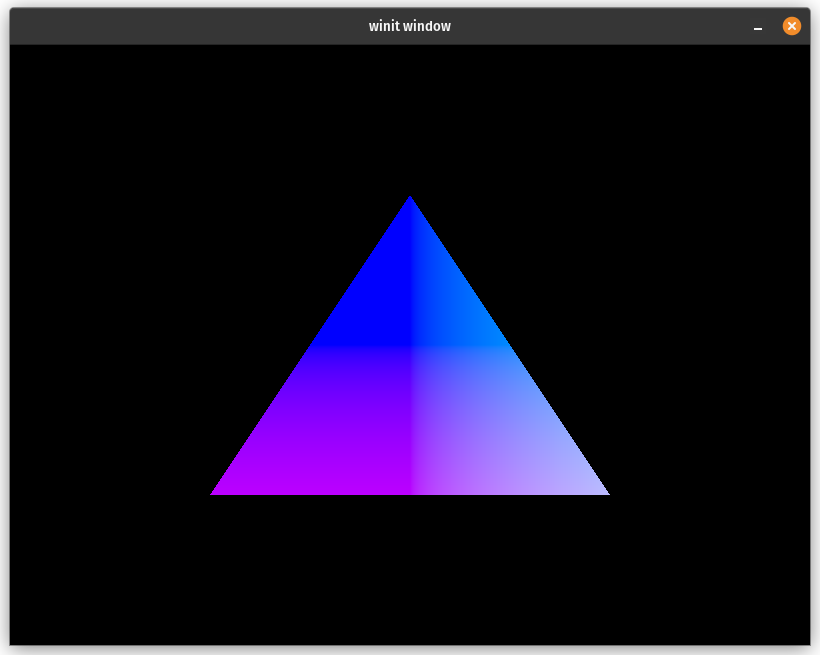

# Description

Rust app using Vulkano to render a cool-color triangle based on 2D vertex positions. Adapted slightly from the Vulkano `triangle-v1_3.rs` example [found here](https://github.com/vulkano-rs/vulkano/blob/v0.34.0/examples/src/bin/triangle-v1_3.rs).

# Output


# Running
Make sure CMake is installed on your system and then run:
```
$ cargo run
```